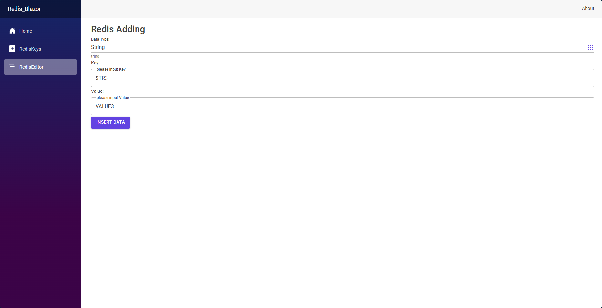

# Redis Web Gui

[中文版](README_zh.md)

A Blazor-based project providing a user-friendly interface for managing and interacting with a Redis database. This application enables users to view, add, edit, and delete Redis keys and values of various data types, including Strings, Hashes, Lists, Sets, and Sorted Sets.

The Docker Image in DockerHub is In  https://hub.docker.com/r/kaikings/redisgui

## ScreenShots





## Features

### Redis Terminal

- **Execute Redis Commands**: Allows you to enter and execute Redis commands directly, with the response shown in a terminal-like output.
- **Command Suggestions**: Provides a quick reference to commonly used Redis commands in the right corner of the terminal page for ease of use.

### Redis Editor

- **Add New Data**: Allows you to create new entries in Redis by specifying the data type (String, Hash, List, Set, SortedSet), key, and value.
- **Data Validation**: Ensures required fields are filled based on the data type.
- **Support for Various Data Types**: Each Redis data type (String, Hash, List, Set, SortedSet) is fully supported with appropriate fields and UI elements.

### Redis Keys Viewer

- **Key Overview**: Lists all Redis keys, organized by type.
- **Search Functionality**: Provides real-time search to filter keys by name.
- **View Details by Type**: View and edit specific values by selecting a key. The application adapts its view based on the key type (e.g., shows a list view for List keys, hash fields for Hash keys, etc.).

## Technology Stack

- **Blazor**: Client-side and server-side components.
- **MudBlazor**: Used for UI components and styling.
- **StackExchange.Redis**: Redis client library for communication with the Redis server.

## Getting Started

### Prerequisites

- .NET 6 SDK or newer
- Redis server (local or remote)
- Redis connection string configured in `appsettings.json`

### Installation

1. Clone the repository

2. Restore the dependencies:

   ```c
   dotnet restore
   ```

3. Run the application:

   ```c
   dotnet run
   ```

4. Open your browser and go to `http://localhost:5000`.

## Configuration

Set up the Redis connection in `appsettings.json`:

```c
"Redis": {
    "ConnectionString": "localhost:6379"
  }
}
```

## Usage

### Redis Terminal

1. Navigate to the `/` route.
2. Enter Redis commands in the input field and press "Send" or "Enter" to execute.
3. The command and its response will appear in the terminal.

### Redis Editor

1. Navigate to the `/redis-editor` route.
2. Select the data type, enter the key, and add the required values based on the data type.
3. Click "Insert Data" to save to Redis.

### Redis Keys Viewer

1. Navigate to the `/redis-keys` route.
2. Click "Load Keys" to load all keys from Redis.
3. Use the search bar to filter keys by name.
4. Select a key to view its details and values.

## Screenshots

Add screenshots here to visually showcase the interface and functionality.

## License

This project is licensed under the MIT License.