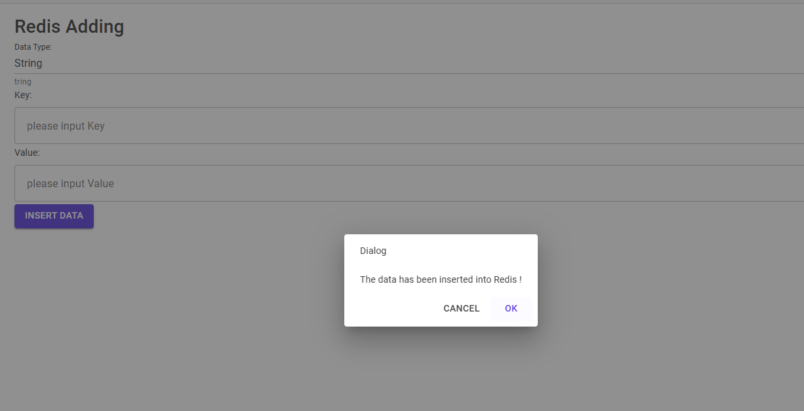

# Redis Web Gui

[English Version](README.md)

一个基于 Blazor 的项目，提供了一个用户友好的界面来管理和交互 Redis 数据库。此应用允许用户查看、添加、编辑和删除各种数据类型的 Redis 键和值，包括字符串、哈希、列表、集合和有序集合。

DockerHub 上的镜像链接为：https://hub.docker.com/r/kaikings/redisgui

## 截图

   

## 功能特点

### Redis 终端

- **执行 Redis 命令**：允许您直接输入和执行 Redis 命令，并在终端样式的输出中显示响应结果。
- **命令建议**：在终端页面右上角提供常用 Redis 命令的快捷参考，方便使用。

### Redis 编辑器

- **添加新数据**：允许您通过指定数据类型（字符串、哈希、列表、集合、有序集合）、键和值来创建 Redis 新条目。
- **数据验证**：根据数据类型确保必填字段已填充。
- **支持多种数据类型**：完全支持 Redis 的各种数据类型（字符串、哈希、列表、集合、有序集合），提供相应的字段和 UI 元素。

### Redis 键查看器

- **键概览**：按类型列出所有 Redis 键。
- **搜索功能**：提供实时搜索功能，以名称筛选键。
- **按类型查看详情**：选择一个键即可查看和编辑特定值。应用根据键的类型自适应视图（例如，显示列表视图用于列表键，显示哈希字段用于哈希键等）。

## 技术栈

- **Blazor**：用于客户端和服务器端组件。
- **MudBlazor**：用于 UI 组件和样式。
- **StackExchange.Redis**：用于与 Redis 服务器通信的 Redis 客户端库。

## 快速开始

### 先决条件

- .NET 6 SDK 或更高版本
- Redis 服务器（本地或远程）
- 在 `appsettings.json` 中配置 Redis 连接字符串

### 安装步骤

1. 克隆此仓库

2. 恢复依赖项：

   ```
   c
   
   
   复制代码
   dotnet restore
   ```

3. 运行应用：

   ```
   c
   
   
   复制代码
   dotnet run
   ```

4. 打开浏览器，访问 `http://localhost:5000`。

## 配置

在 `appsettings.json` 中设置 Redis 连接：

```
c复制代码"Redis": {
    "ConnectionString": "localhost:6379"
  }
}
```

## 使用指南

### Redis 终端

1. 进入 `/` 路由。
2. 在输入框中输入 Redis 命令并按“发送”或“回车”执行。
3. 命令及其响应将显示在终端中。

### Redis 编辑器

1. 进入 `/redis-editor` 路由。
2. 选择数据类型，输入键，并根据数据类型添加所需的值。
3. 点击“插入数据”保存到 Redis。

### Redis 键查看器

1. 进入 `/redis-keys` 路由。
2. 点击“加载键”以加载 Redis 中的所有键。
3. 使用搜索栏按名称筛选键。
4. 选择一个键查看其详细信息和值。